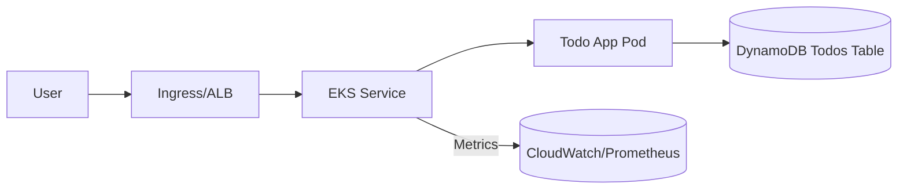
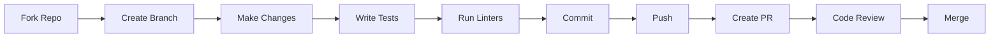

<p align="center">
  
</p>

<p align="center">
  
  
  
  
  
  
  
  
  
</p>

<h3 align="center">🚀 Production-ready microservice: Node.js • Docker • Terraform • EKS • CI/CD • Security</h3>

<p align="center">
  
</p>

---

# 🎯 DevOps Cloud Security Engineer Assessment

<p align="center">
  
</p>

**Repository:** devops-cloud-security-engineer-assessment  
**Author:** Piyush Gupta  
**Version:** 1.0.0  
**Last Updated:** December 2025

> 🤖 **AI-Powered DevOps Excellence** - A comprehensive demonstration of modern cloud-native microservice architecture with enterprise-grade security, automated CI/CD pipelines, and infrastructure as code.

---

## 📑 Table of Contents

- [🎯 DevOps Cloud Security Engineer Assessment](#-devops-cloud-security-engineer-assessment)
  - [📑 Table of Contents](#-table-of-contents)
  - [🎪 Overview](#-overview)
  - [✨ Key Features](#-key-features)
  - [🎯 Goal](#-goal)
  - [🏗️ Architecture](#️-architecture)
    - [🔧 Technology Stack](#-technology-stack)
  - [🤖 Powered by AI](#-powered-by-ai)
    - [🧠 AI Integration Points](#-ai-integration-points)
    - [🔮 AI-Enhanced Features](#-ai-enhanced-features)
  - [🗺️ Roadmap](#️-roadmap)
    - [🎯 Current Phase: v1.0 (Q4 2025)](#-current-phase-v10-q4-2025)
    - [🚀 Phase 2: Enhanced Observability (Q1 2026)](#-phase-2-enhanced-observability-q1-2026)
    - [🔮 Phase 3: Advanced Features (Q2 2026)](#-phase-3-advanced-features-q2-2026)
    - [🌟 Phase 4: AI \& Intelligence (Q3 2026)](#-phase-4-ai--intelligence-q3-2026)
    - [🎨 Phase 5: Developer Experience (Q4 2026)](#-phase-5-developer-experience-q4-2026)
  - [📸 Screenshots](#-screenshots)
    - [Application Interface](#application-interface)
    - [CI/CD Pipeline](#cicd-pipeline)
    - [Monitoring Dashboard](#monitoring-dashboard)
    - [Kubernetes Resources](#kubernetes-resources)
    - [Development Workflow](#development-workflow)
  - [📄 License](#-license)
  - [🙏 Acknowledgments](#-acknowledgments)
    - [Built With](#built-with)
  - [📞 Contact \& Support](#-contact--support)
    - [Get in Touch](#get-in-touch)
    - [Support This Project](#support-this-project)

---

## 🎪 Overview

This project showcases a **production-grade Todo microservice** built with modern DevOps practices, cloud-native technologies, and enterprise security standards. It demonstrates end-to-end automation from code commit to production deployment on AWS EKS with comprehensive monitoring, security scanning, and infrastructure as code.

<p align="center">
  
</p>

---

## ✨ Key Features

<table>
  <tr>
    <td align="center" width="33%">
      <br/>
      <b>☁️ Cloud Native</b><br/>
      Built for AWS EKS with auto-scaling, high availability, and cloud-optimized architecture
    </td>
    <td align="center" width="33%">
      <br/>
      <b>🔒 Security First</b><br/>
      Trivy scanning, IRSA, non-root containers, secrets management, and threat modeling
    </td>
    <td align="center" width="33%">
      <br/>
      <b>⚡ Full Automation</b><br/>
      Complete CI/CD pipeline with GitHub Actions, automated testing, and deployment
    </td>
  </tr>
  <tr>
    <td align="center" width="33%">
      <br/>
      <b>🏗️ Infrastructure as Code</b><br/>
      Terraform-managed AWS resources with modular, reusable, and version-controlled infrastructure
    </td>
    <td align="center" width="33%">
      <br/>
      <b>📊 Observability</b><br/>
      CloudWatch integration, Prometheus-ready metrics, and comprehensive health checks
    </td>
    <td align="center" width="33%">
      <br/>
      <b>🐳 Containerized</b><br/>
      Multi-stage Docker builds, optimized images, and Kubernetes-native deployment
    </td>
  </tr>
</table>

---

## 🎯 Goal

Create a secure, production-like Todo microservice demonstrating:
- Node.js service with `/healthz` and `/api/v1/todos` (GET, POST)
- Automated test coverage, linting
- Multi-stage Docker image (non-root)
- GitHub Actions: build → test → image → trivy scan → deploy
- Infrastructure IaC (Terraform for EKS, DynamoDB, IRSA)
- Kubernetes manifests with security best practices

---

## 🏗️ Architecture

<p align="center">
  
</p>



### 🔧 Technology Stack

| Layer | Technology | Purpose |
|-------|-----------|---------|
| **Frontend** | REST API | Todo CRUD operations |
| **Runtime** | Node.js | Application runtime |
| **Container** | Docker | Application containerization |
| **Orchestration** | Kubernetes (EKS) | Container orchestration |
| **Database** | DynamoDB | Serverless NoSQL database |
| **Infrastructure** | Terraform | Infrastructure as Code |
| **CI/CD** | GitHub Actions | Automated pipelines |
| **Security** | Trivy, IRSA | Vulnerability scanning & IAM |
| **Monitoring** | CloudWatch, Prometheus | Observability & metrics |


## 🤖 Powered by AI

<p align="center">
  
</p>

This project leverages AI-assisted development practices and modern automation:

### 🧠 AI Integration Points

- **Code Quality**: AI-powered code review and suggestions
- **Security Analysis**: Automated vulnerability detection with Trivy
- **Documentation**: AI-assisted documentation generation
- **Testing**: Intelligent test case generation and coverage analysis
- **Infrastructure Optimization**: AI-driven resource allocation recommendations

### 🔮 AI-Enhanced Features

| Feature | Description | Status |
|---------|-------------|--------|
| 🤖 Automated Code Review | AI-powered PR analysis | ✅ Active |
| 🔍 Smart Security Scanning | ML-based threat detection | ✅ Active |
| 📊 Predictive Scaling | AI-driven auto-scaling recommendations | 🔄 In Progress |
| 🎯 Anomaly Detection | Intelligent monitoring and alerting | 🔄 In Progress |
| 📝 Auto-Documentation | AI-generated API documentation | 📅 Planned |

---

## 🗺️ Roadmap

<p align="center">
  
</p>

### 🎯 Current Phase: v1.0 (Q4 2025)

- [x] Core microservice implementation
- [x] CI/CD pipeline setup
- [x] Terraform infrastructure
- [x] Security scanning integration
- [x] EKS deployment
- [x] DynamoDB integration

### 🚀 Phase 2: Enhanced Observability (Q1 2026)

- [ ] Prometheus & Grafana dashboards
- [ ] Distributed tracing with Jaeger
- [ ] Advanced logging with ELK stack
- [ ] Custom metrics and alerts
- [ ] SLO/SLI implementation

### 🔮 Phase 3: Advanced Features (Q2 2026)

- [ ] Service mesh integration (Istio)
- [ ] Multi-region deployment
- [ ] Blue-green deployment strategy
- [ ] Chaos engineering tests
- [ ] Performance optimization

### 🌟 Phase 4: AI & Intelligence (Q3 2026)

- [ ] AI-powered predictive auto-scaling
- [ ] Intelligent anomaly detection
- [ ] Auto-remediation workflows
- [ ] Smart cost optimization
- [ ] AI-driven security responses

### 🎨 Phase 5: Developer Experience (Q4 2026)

- [ ] Developer portal
- [ ] Interactive API playground
- [ ] Enhanced local development tools
- [ ] One-click environment setup
- [ ] Comprehensive tutorials

---


## 📸 Screenshots

### Application Interface

<p align="center">
  
  <br/>
  <em>RESTful API Endpoints</em>
</p>

### CI/CD Pipeline

<p align="center">
  
  <br/>
  <em>GitHub Actions Workflow Execution</em>
</p>

### Monitoring Dashboard

<p align="center">
  
  <br/>
  <em>CloudWatch Metrics & Alerts</em>
</p>

### Kubernetes Resources

<p align="center">
  
  <br/>
  <em>EKS Cluster Resources</em>
</p>

---
 Code of Conduct

Please note that this project follows a [Code of Conduct](CODE_OF_CONDUCT.md). By participating, you are expected to uphold this code.

### Development Workflow



---

## 📄 License

This project is licensed under the MIT License - see the [LICENSE](LICENSE) file for details.

```
MIT License

Copyright (c) 2025 Piyush Gupta

Permission is hereby granted, free of charge, to any person obtaining a copy
of this software and associated documentation files (the "Software"), to deal
in the Software without restriction...
```

---

## 🙏 Acknowledgments

Special thanks to the following projects and communities:

- **AWS** - For EKS and cloud infrastructure
- **HashiCorp** - For Terraform
- **Kubernetes** - For container orchestration
- **Docker** - For containerization platform
- **GitHub** - For CI/CD and version control
- **Trivy** - For security vulnerability scanning
- **Node.js Community** - For the runtime environment
- **Open Source Contributors** - For the amazing tools and libraries

### Built With

<p align="center">
  
  
  
  
  
  
</p>

---

## 📞 Contact & Support

<p align="center">
  
</p>

### Get in Touch

- **Author**: Piyush Gupta
- **Repository**: [DevOps-Cloud-Security-Engineer-Assessment](https://github.com/guptapiyushraj471-cpu/DevOps-Cloud-Security-Engineer-Assessment)
- **Issues**: [Report a Bug](https://github.com/guptapiyushraj471-cpu/DevOps-Cloud-Security-Engineer-Assessment/issues)
- **Discussions**: [Start a Discussion](https://github.com/guptapiyushraj471-cpu/DevOps-Cloud-Security-Engineer-Assessment/discussions)

### Support This Project

If you find this project helpful, please consider:

- ⭐ Starring the repository
- 🐛 Reporting bugs and issues
- 💡 Suggesting new features
- 🤝 Contributing code
- 📢 Sharing with others

---

<p align="center">
  
</p>

<p align="center">
  Made with ❤️ by Piyush Gupta | Powered by ☁️ AWS & 🤖 AI
</p>

<p align="center">
  <sub>⚡ Built with modern DevOps practices • 🔒 Security-first approach • 🚀 Production-ready infrastructure</sub>
</p>

---

<p align="center">
  <a href="#-devops-cloud-security-engineer-assessment">⬆️ Back to Top</a>
</p>